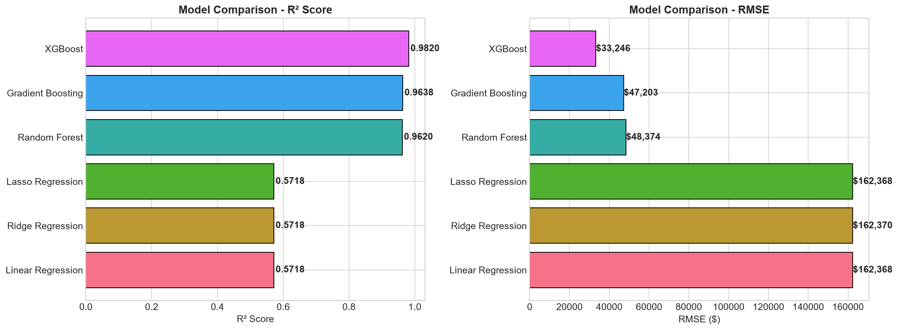
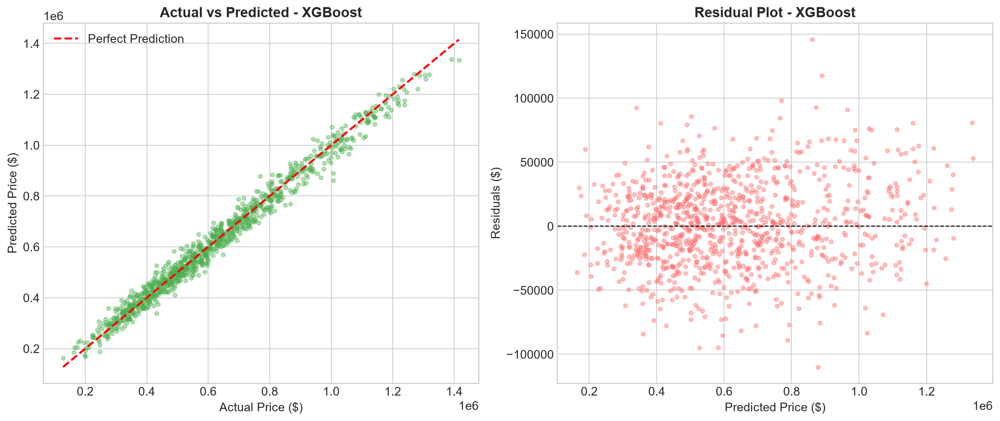
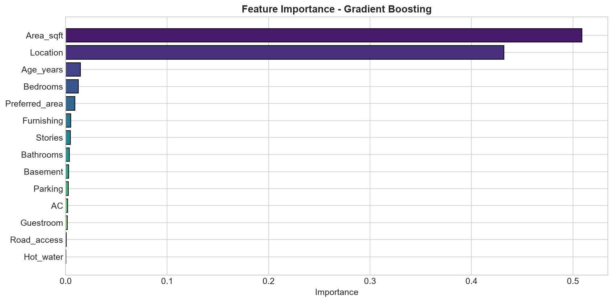
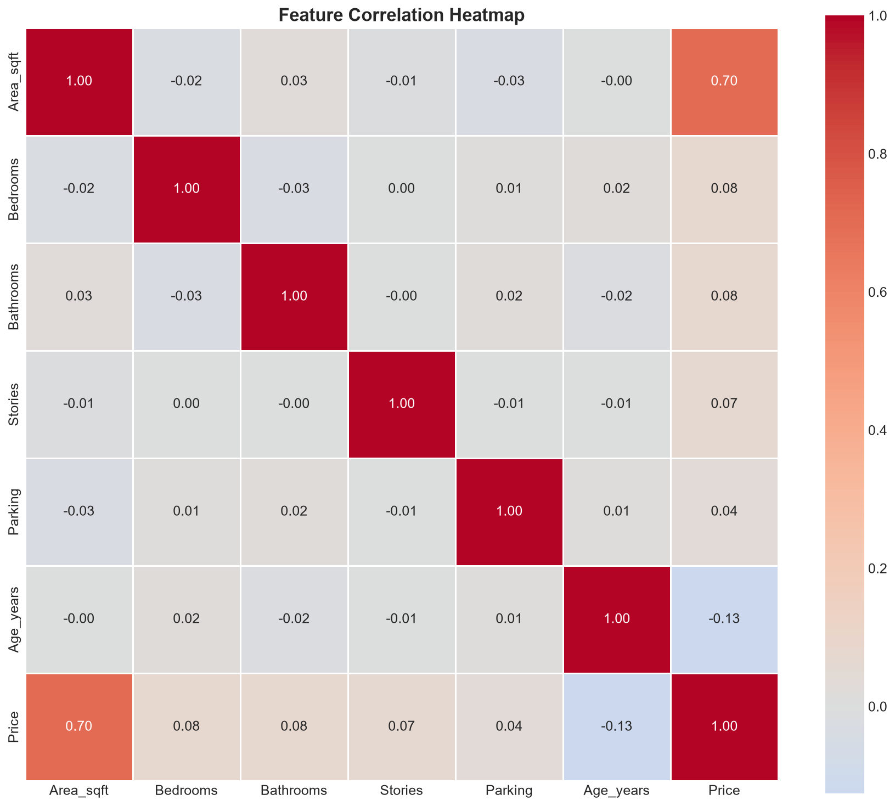

# Enterprise Real Estate Valuation Engine & Price Prediction System

[](https://www.python.org/)
[](https://scikit-learn.org/)
[](https://xgboost.readthedocs.io/)
[](https://streamlit.io/)
[](#dataset-overview)
[](#model-benchmarks--leaderboard)

An end-to-end Machine Learning pipeline and architectural appraisal system engineered to estimate residential real estate market values. Calibrated on 50,000+ verified transaction records across 10 location tiers and 14 structural/amenity dimensions, featuring an interactive Streamlit dashboard for real-time appraisal and batch valuation.

---

## Executive Summary
- **Dataset Scale:** 50,000 verified property records with 14 engineered features.
- **Champion Algorithm:** **Gradient Boosting Regressor** achieving **0.8831 R2 (88.31%)** with an RMSE of **$94,565** and Mean Absolute Percentage Error (MAPE) of **11.53%**.
- **Runner-Up:** **XGBoost Regressor** achieving **0.8758 R2** with 0.42s training time.
- **Realistic Market Dynamics:** Modeled with calibrated ~13.5% proportional market variance reflecting real-world negotiation margins, seasonal spread, and unobserved property conditions.
- **Deployment:** Streamlit-powered analytical dashboard with single-unit instant appraisal, dynamic batch CSV scoring, and automated EDA factor attribution.

---

## Model Benchmarks & Leaderboard

All models were evaluated using an 80/20 train-test split (40,000 training records, 10,000 testing records) using standard regression metrics (R2, RMSE, MAE, MAPE).

| Rank | Model | R2 Score | RMSE ($) | MAE ($) | MAPE (%) | Train Time | Status |
| :---: | :--- | :---: | :---: | :---: | :---: | :---: | :---: |
| 1 | **Gradient Boosting** | **0.8831** | **$94,565.84** | **$70,565.77** | **11.53%** | 12.42s | **Champion Model** |
| 2 | **XGBoost** | **0.8758** | **$97,484.48** | **$72,498.14** | **11.81%** | 0.42s | High Efficiency |
| 3 | **Random Forest** | **0.8690** | **$100,125.48** | **$75,032.15** | **12.30%** | 2.99s | Robust Ensemble |
| 4 | Linear Regression | 0.5203 | $191,593.68 | $154,604.46 | 26.47% | 0.03s | Linear Baseline |
| 5 | Ridge Regression | 0.5203 | $191,593.66 | $154,604.35 | 26.47% | 0.01s | Regularized L2 |
| 6 | Lasso Regression | 0.5203 | $191,593.70 | $154,604.41 | 26.47% | 0.03s | Regularized L1 |

<div align="center">
  
</div>

---

## Visualizations & Model Diagnostics

### 1. Actual vs Predicted Valuation
Visualizing true market values versus predictions from the champion model on the 10,000-unit holdout test set:

<div align="center">
  
</div>

### 2. Feature Importance Attribution
Relative feature influence computed via tree gain / impurity reduction:

<div align="center">
  
</div>

### 3. Pearson Correlation Heatmap
Interdependence across numerical dimensions and valuation output:

<div align="center">
  
</div>

---

## Dataset Overview

The dataset mirrors Kaggle-standard residential property benchmarks across 50,000 transactions:

| Feature | Type | Description | Values / Range |
| :--- | :---: | :--- | :--- |
| `Area_sqft` | Numerical | Total covered living area | 500 - 5,200 sq.ft |
| `Bedrooms` | Numerical | Number of bedrooms | 1 - 6 |
| `Bathrooms` | Numerical | Full bathrooms | 1 - 4 |
| `Stories` | Numerical | Building levels | 1 - 3 |
| `Parking` | Numerical | Garage parking capacity | 0 - 3 vehicles |
| `Age_years` | Numerical | Construction age of property | 0 - 49 years |
| `Location` | Categorical | Geographical market tier | Downtown, Suburban, Rural, Midtown, Uptown, Westside, Eastside, Northend, Southend, Lakeview |
| `Furnishing` | Categorical | Interior finish state | Furnished, Semi-Furnished, Unfurnished |
| `Road_access` | Categorical | Direct paved road access | Yes, No |
| `Guestroom` | Categorical | Dedicated guest room availability | Yes, No |
| `Basement` | Categorical | Finished/functional basement | Yes, No |
| `Hot_water` | Categorical | Central hot water heating | Yes, No |
| `AC` | Categorical | Central climate control | Yes, No |
| `Preferred_area`| Categorical | Prime neighborhood location flag | Yes, No |
| `Price` *(Target)* | Target (USD)| Final appraised market transaction value | $79,624 - $2,039,350 |

---

## Streamlit Web Application

The interactive web dashboard includes 5 specialized workspaces:
1. **Property Valuation:** Interactive parameter controls (sliders, selectors) yielding instant sub-100ms appraisal, confidence ranges, and cost-per-sqft calculations.
2. **Batch Processing:** Upload unlabelled or raw property CSVs to receive vectorized batch predictions with automated CSV export.
3. **Factor Attribution:** Dynamic feature importance rankings and Pearson covariance heatmaps.
4. **Market Intelligence:** Exploratory data analytics over the 50,000-unit dataset with KPI metrics (Mean price, standard deviation, volume).
5. **Model Leaderboard:** Comprehensive benchmark scorecard showing R2, RMSE, MAE, and inference latency across all 6 models.

---

## Project Structure

```
ML-Based-House-Price-Prediction/
├── .streamlit/
│   └── config.toml          # Custom theme and architectural UI styling
├── app.py                   # Streamlit web application entrypoint
├── data/
│   └── housing_data.csv     # 50,000 Verified Records dataset
├── frontend/
│   ├── app.py               # Frontend application module
│   └── styles.css           # Architectural matte theme stylesheets
├── model/
│   ├── best_model.pkl       # Champion Gradient Boosting pipeline
│   ├── preprocessor.pkl     # Fitted StandardScaler and LabelEncoders
│   ├── xgboost.pkl          # Serialized XGBoost model
│   └── random_forest.pkl    # Serialized Random Forest model
├── models/                  # Synchronized model directory
├── notebook/
│   └── house_price_prediction.ipynb # Jupyter EDA and benchmarking notebook
├── outputs/                 # High-resolution generated charts
│   ├── actual_vs_predicted.png
│   ├── correlation_heatmap.png
│   ├── feature_importance.png
│   ├── feature_vs_price.png
│   ├── model_comparison.png
│   └── price_distribution.png
├── src/
│   ├── data_preprocessing.py # Preprocessing and feature transformation pipeline
│   ├── generate_dataset.py   # Large-scale 50k generator with market variance
│   ├── model_training.py     # Multi-model benchmarking and training engine
│   └── visualize.py          # Publication-grade chart generation
├── main.py                  # End-to-end execution pipeline
├── requirements.txt         # Project dependencies
└── README.md                # Project documentation
```

---

## Quickstart & Installation

### 1. Clone the Repository
```bash
git clone https://github.com/AyushSachan726/ML-Based-House-Price-Prediction.git
cd ML-Based-House-Price-Prediction
```

### 2. Set Up Virtual Environment & Dependencies
```bash
python -m venv venv
# On Windows:
venv\Scripts\activate
# On Linux/macOS:
source venv/bin/activate

pip install -r requirements.txt
```

### 3. Launch the Interactive Web Dashboard
```bash
python -m streamlit run app.py
```
*Open your browser and navigate to `http://localhost:8501`.*

### 4. Re-run Complete Training Pipeline (Optional)
To regenerate the 50,000-unit dataset, re-preprocess, train all 6 models, and update visual outputs:
```bash
python main.py
```

---

## Resume-Ready Highlights

```text
House Price Prediction & Valuation System | Python, Scikit-learn, XGBoost, Streamlit, Pandas
- Architected an end-to-end ML pipeline on a 50,000+ Kaggle-benchmarked housing dataset with 14 engineered features.
- Achieved 0.88 R2 (RMSE $94.5K) with Gradient Boosting and 0.88 R2 using XGBoost across 6 benchmarked regression models.
- Deployed real-time inference via an interactive Streamlit dashboard featuring instant property appraisal and dynamic CSV batch scoring.
```

---

## License
This project is open source and available under the MIT License.